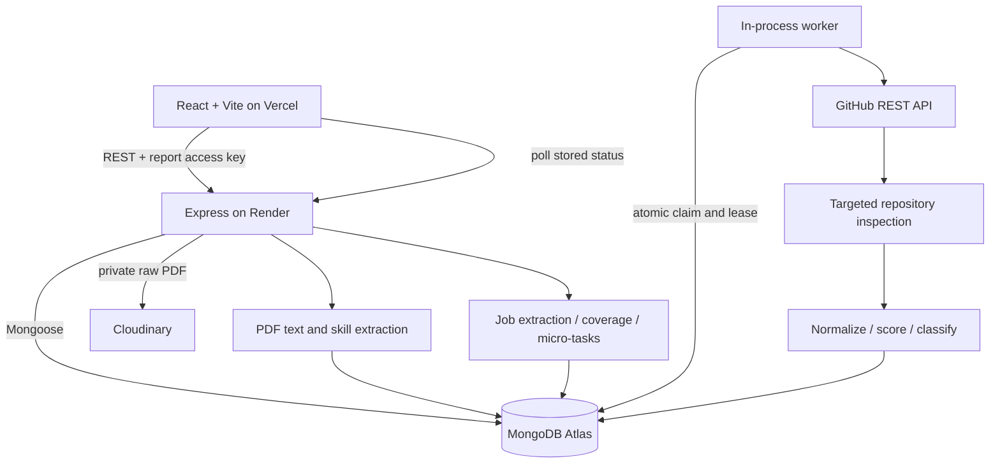
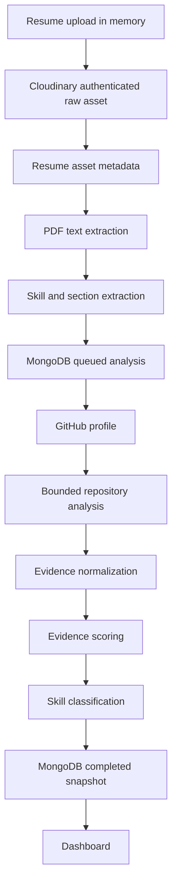

# Architecture

## Application boundaries

The frontend and backend have independent package manifests and lockfiles for deployment. Root scripts only provide local convenience. React pages compose reusable components; Axios calls live in API services; a small context owns browser-local report keys. Express routes attach middleware and thin controllers. Services own PDF parsing, cloud storage, GitHub requests, scoring, matching, and queue execution. Schemas and configuration are centralized.

MongoDB holds `analyses` and `jobanalyses`. Candidate information, structured resume extraction, GitHub profile, bounded repository summaries, evidence, and progress are embedded in one analysis snapshot. A job references its candidate analysis and embeds matching results and micro-tasks. Binary files live in Cloudinary, never MongoDB or persistent local directories.

## Exact upload and analysis flow

The brief's logical flow is preserved, with one extra early persistence point for durability. Cloudinary upload and PDF extraction finish in the creation request. The response returns HTTP 202 with a report key only after MongoDB stores the extracted resume. The long GitHub phase runs asynchronously and writes actual progress. If parsing or record creation fails, the uploaded asset is removed on a best-effort rollback.

## Why these choices

- **MERN:** one JavaScript ecosystem across the requested React UI and REST services.
- **MongoDB:** nested, variable evidence snapshots fit document storage; atomic claims avoid an additional queue service.
- **Cloudinary:** managed binary storage outlives Render's ephemeral filesystem; authenticated raw delivery keeps PDFs private.
- **GitHub REST:** targeted metadata/content endpoints provide inspectable URLs without cloning or running untrusted code.
- **Deterministic extraction and rule-based scores:** transparent rules and predictable behavior without model-provider setup, inference cost, or fabricated reasoning.
- **Asynchronous GitHub analysis:** multiple network requests should not hold the upload request open; users can reopen stored progress.
- **Repository limits and caching:** bound upstream requests, response size, memory, and free-tier resource usage.
- **Vercel/Render split:** static frontend hosting and a conventional long-running Express process suit the requested deployment topology.

## Worker and recovery

One worker runs inside each backend process, claiming at most one analysis at a time. It polls every two seconds, atomically claims queued or expired work, and uses a random owner plus a two-minute lease. Thirty-second heartbeats extend the lease. Owner-qualified writes prevent a stale worker from overwriting a reclaimed job. Interrupted work is attempted up to three times before being marked failed; explicit user retry resets attempts. External API errors fail visibly rather than silently producing a complete-looking zero-evidence report.

The worker is not an always-on distributed service. Render sleep suspends progress; wake-up resumes claim processing. Rate limiting and response caching are per process. See [limitations](limitations.md) before horizontal scaling or production use with sensitive hiring data.

## Access and request flow

An analysis and each job have independent random access keys. Keys are hashed in MongoDB and checked before reads or changes. A candidate-linked job must be created using the candidate key. Report paths alone do not authorize access. The UI stores keys locally and supports importing/exporting them. No account login, key recovery, or organization membership model is claimed.

GET requests return `{ success: true, data }`. Failures return `{ success: false, error: { code, message, requestId } }`; background errors live inside the authorized analysis document. The backend excludes access hashes, worker leases, and Cloudinary asset identifiers/URLs from public report responses.

## Further detail

- [Frontend architecture](../frontend/docs/architecture.md)
- [Backend architecture](../backend/docs/architecture.md)
- [Database](../backend/docs/database.md)
- [Business logic](business-logic.md)
- [Deployment](deployment-overview.md)
