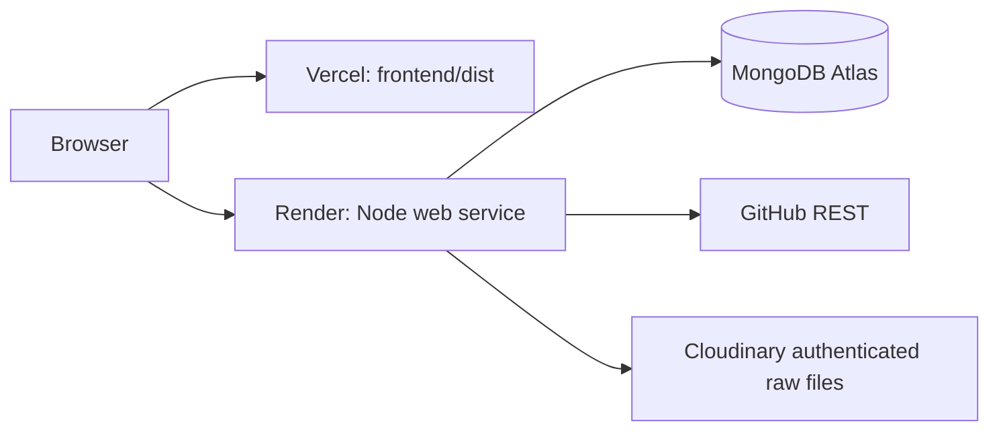

# Deployment overview

## Setup order

1. Push the repository to your Git provider. No push or cloud deployment is performed by the implementation scripts.
2. Create an Atlas free cluster and restricted database user. Set network access for development and the Render service's outbound ranges.
3. Create a Cloudinary product environment and obtain server credentials.
4. Create a GitHub read-only/public-content API credential if needed.
5. Create the Render service from `render.yaml`. Supply `MONGO_URI`, Cloudinary variables, `GITHUB_TOKEN`, and the intended frontend origin. `PORT` comes from Render; the server binds `0.0.0.0`.
6. Import the Vercel project with root `frontend`, Node 22, `npm ci`, `npm run build`, and output `dist`.
7. Set `VITE_API_BASE_URL` to the Render HTTPS origin plus `/api`. Deploy, copy the resulting frontend origin to Render `CLIENT_ORIGIN`, and redeploy the backend.
8. Configure additional allowed origins explicitly when using preview deployments. Environment changes in Vite require rebuilding the frontend.

## Free-tier boundaries

The configuration requests Render's free web-service plan and no persistent disk, Redis service, or separate paid worker. Render free web services can spin down after inactivity, have resource quotas, and use an ephemeral filesystem. MongoDB persists queued work and leases across process restarts; it does not keep the Render process awake. Active frontend polling generates traffic while someone is waiting. Interrupted work can repeat upstream requests. See [Render free service documentation](https://render.com/docs/free).

Atlas and Cloudinary account quotas and free-plan availability are managed by those providers. Storage does not automatically expire: delete a candidate report through the application to remove its PDF and linked jobs. Observe usage in provider dashboards. No claim is made that hosting plans have production uptime guarantees or that a free deployment has been provisioned.

## Configuration references

- [Render Blueprint reference](https://render.com/docs/blueprint-spec)
- [Vite on Vercel and SPA routing](https://vercel.com/docs/frameworks/frontend/vite)
- [Backend deployment](../backend/docs/deployment.md)
- [Frontend deployment](../frontend/docs/deployment.md)
- [Cloudinary setup](../backend/docs/cloudinary.md)

## Operational acceptance

After you supply real credentials and deploy, confirm the upload → GitHub analysis → evidence → job match flow using a permitted real resume. Confirm authorized access and deletion, restart recovery, and actual cloud settings before inviting users. This is an operator checklist, not a claim that browser, E2E, load, or live-cloud testing was performed during implementation.
