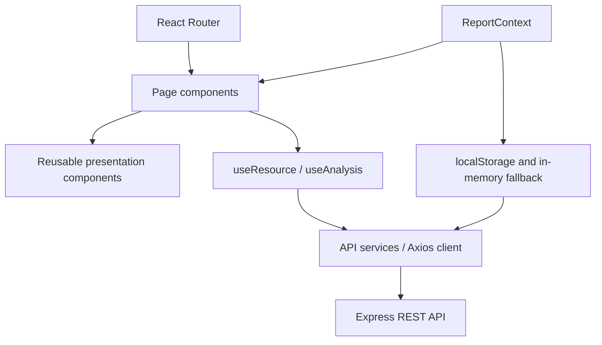

# Frontend architecture

`main.jsx` mounts the root error boundary, router, report provider, and App. App defines routes and lazy-loads pages. `AppLayout` supplies responsive navigation, page frame, and the main landmark. The landing route has its own public layout.

## Routing

`/`, `/analyze`, `/analysis/:id`, `/analysis/:id/skills`, `/analysis/:id/skills/:skill`, `/jobs`, `/jobs/:id`, `/reports`, `/methodology`, and a not-found route are implemented. `/jobs?analysis=ID` preselects the candidate when opened from its dashboard. Vercel rewrites support direct navigation to SPA routes.

## State ownership

- Local form/search/filter state belongs to its page/component.
- `useResource` handles initial loading, errors, retries, request cancellation, and optional polling. It schedules the next poll only after a response; it never overlaps polls from the same hook.
- `useAnalysis` polls every 2.5 seconds while status is queued or processing, stops on completed/failed/network error, and updates locally displayed report status/name.
- `ReportContext` manages local report metadata and access keys; there is no global candidate cache or Redux store.
- `ReportGate` decides whether to show loading, authorized-access recovery, backend failure/retry, progress, or completed content.
- Micro-task changes persist through a PATCH API, then refresh the page's job state with the returned document.

Access keys use localStorage with a memory fallback. If persistent storage fails, a visible message asks the user to export a key before closing the tab. Key export is a user-initiated JSON download. Key import validates the ID, token shape, and report type. The backend remains the authority on whether the imported key is valid.

## Rendering and boundaries

Resume and README-derived content is rendered as React text, never injected HTML. External URLs pass an HTTP(S) allowlist and open with `noopener noreferrer`. Tables scroll on narrow screens; navigation becomes a mobile drawer; lazy pages reduce the initial bundle. A semantic doughnut chart has an accessible text label and a visible legend. There is no fabricated result while data is unavailable.
